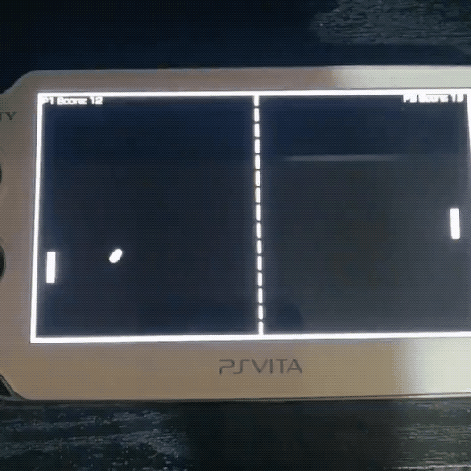

Lua Pong
==================

My attempt at a Pong clone for the PS Vita™ made on [Lua Player Plus Vita](https://github.com/Rinnegatamante/lpp-vita).
This project was done mainly for self learning purposes. You are free to use or distribute the source any way you like.

## To do List:
* Add CPU player (1 player mode)
* Add a Menu

## Credits

- [Rinnegatamante](https://github.com/Rinnegatamante) for [lpp-vita](https://github.com/Rinnegatamante/lpp-vita)
